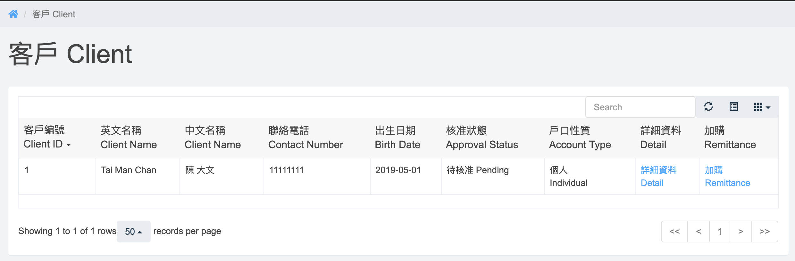
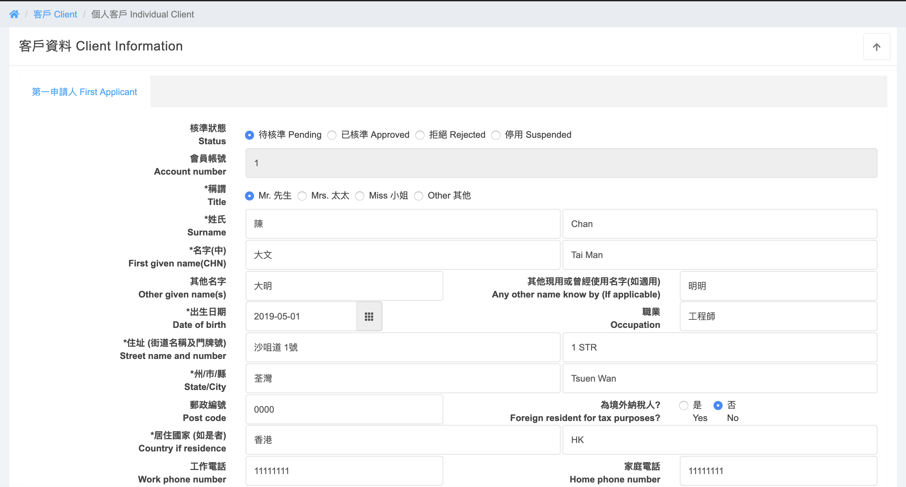
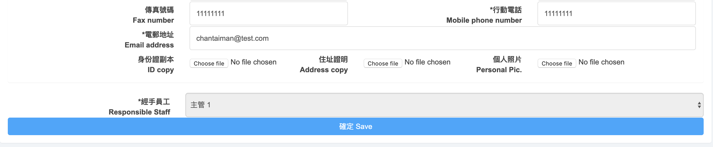
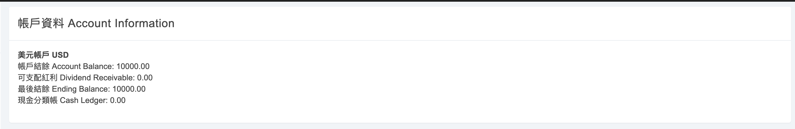
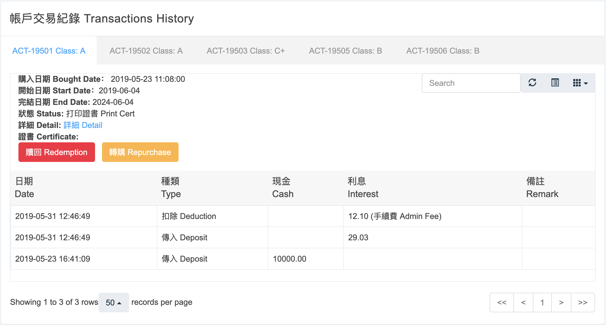

#Client
Side Menu -> `客戶 Client` 
  

Click `詳細資料 Detail` in the client list
  
  
Click `top right arrow` can hide or show the client information   
Update the client information, click `確定 Save`

#Account Information
  
Separate to different currency

#Transaction History
  
Click `tab` to view different contract transaction history   
Click `詳細 Detail` will go to contract detail page   
Click `贖回 Redemption` will go to redemption page   
Click `轉購 Repurchase` will go to repurchase page   

#Remittance
Click `加購 Remittance` in the client list

#Redemotion

#Repurchase