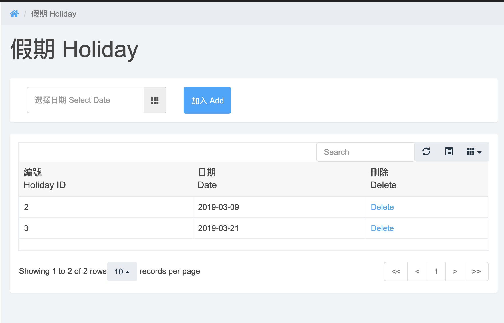
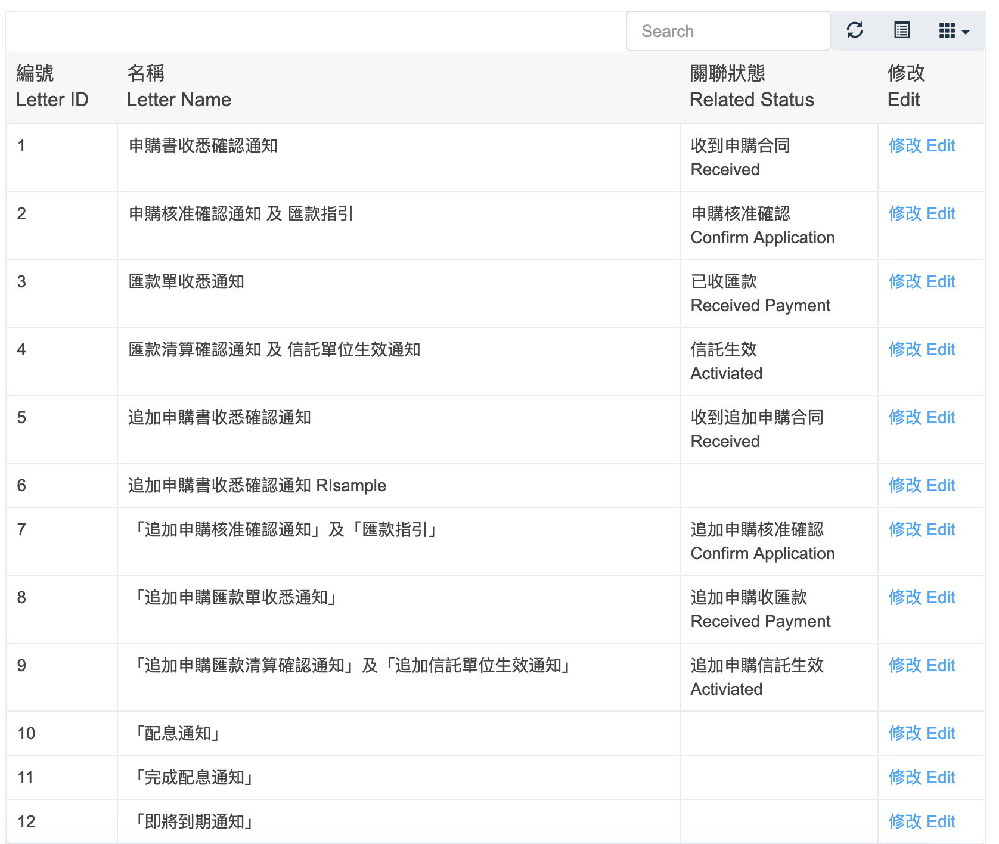
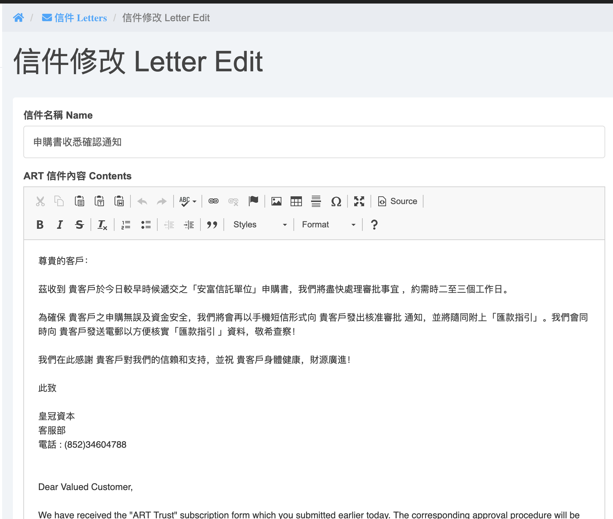
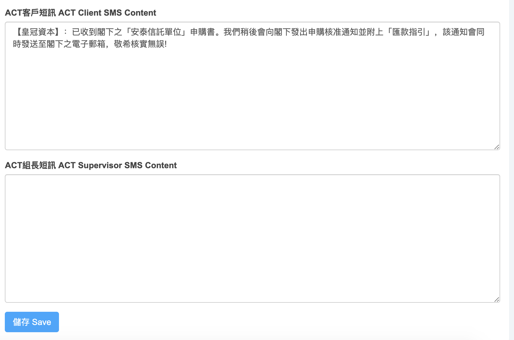
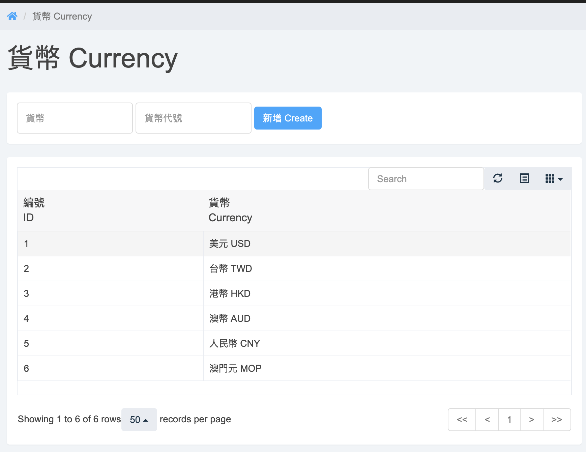

#Holidays

Side Menu -> `設定 configs` -> `假期 Holidays`  
  
Select `date`, click `加入 Add`

#Letter & SMS
Side Menu -> `設定 configs` -> `信件 Letterss`  
  

#Edit Letter & SMS
click `修改 Edit` in Letter List
 
 
Click `確定 Save` at the bottom to save

#Currency
 
Input the currency, click `新增 Create`

#View Pending Email/SMS/Certificate/Monthly Statement
Side Menu -> `電郵/短訊 Email/SMS`   
There is a schedule program to send out the Email and SMS. 
The schedule program will also generate the Certificate when the contract status is `打印證書 Print Cert`   
The monthly statement will auto generate on every 23th