# Contract

Side Menu -> `合約 Contract` 

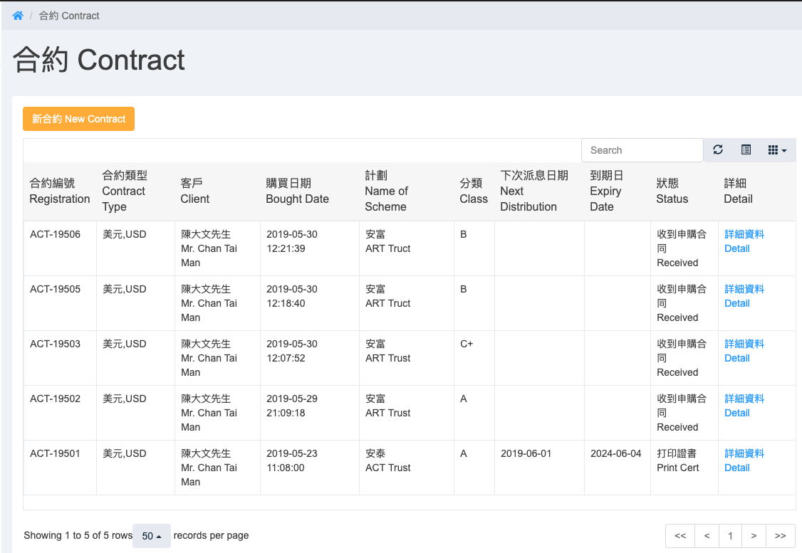  

# New Contract & New Client
Click `新合約 contract`

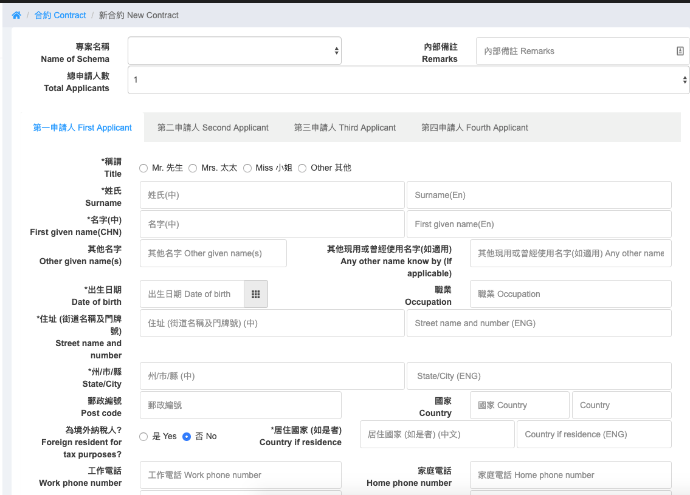  
Fill in the form

```
When Total Applicants more than 1, the account will be joint Account
```

```
Fill dfifferent applicant by click the tab *第N申請人 N Applicant*
```

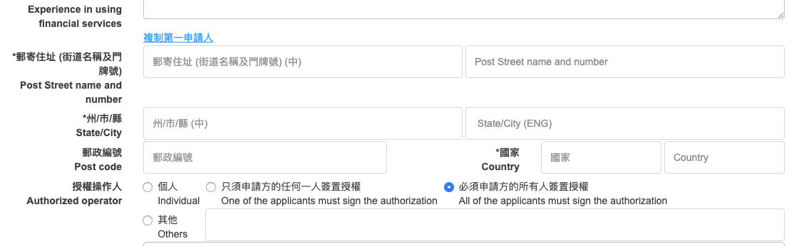  
```
Click *複制第一申請人* to copy the first applicant address
```

Click `確定 Save`, after save successful, will return to contract detail page

#Contract Detail
Click `詳細資料 Detail` in the contract list

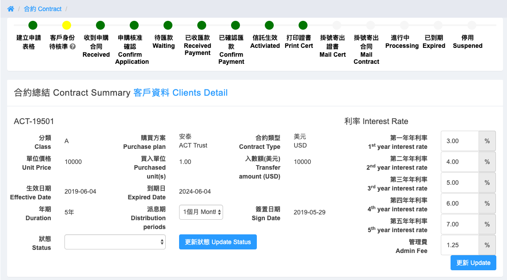  
```
Click `客戶資料 Clients Detail` can go to the client detail page
```

#Distribution & Status
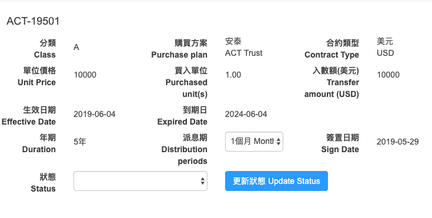  
Change `派息期 Distribution` and `狀態 Status`, click `更新狀態 Update Status`

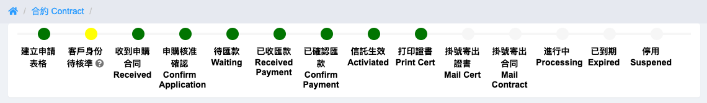  
Update the status, the `status` bar will be changed. Different status will trigger send different `email` and `sms`
```
Internal link
```

#Interest Rate
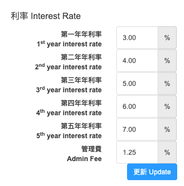  
update the `利率 Interest Rate`, click `更新 Update`   
update interest rate will re-calculate the interest

#Contract Information
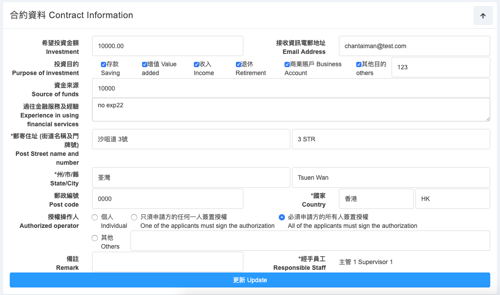  
Click `top right arrow` can hide or show the contract information   
Update the contract information, click `更新 Update`

#Deposit Slip
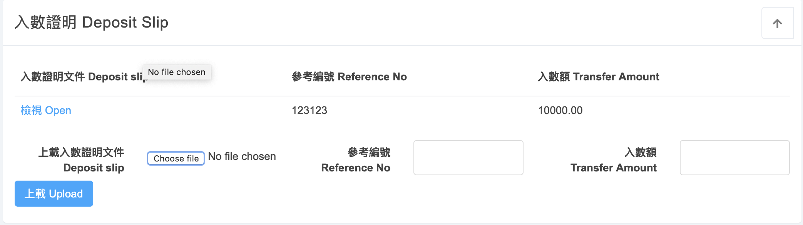  
Click `top right arrow` can hide or show the Deposit Slip   
Select the file of `Deposit slip` and enter the `Transfer Amount`, click `上載 Upload`  
After upload successful, click `檢視 Open` to view the `Deposit slip`

#Signed Contract
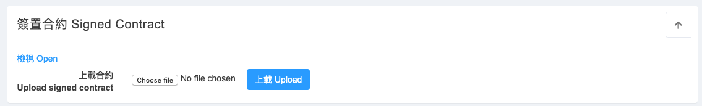  
Click `top right arrow` can hide or show the Signed Contract   
Select the file of `signed contract`, click `上載 Upload`  
After upload successful, click `檢視 Open` to view the `Signed contract`

#Interet distribution
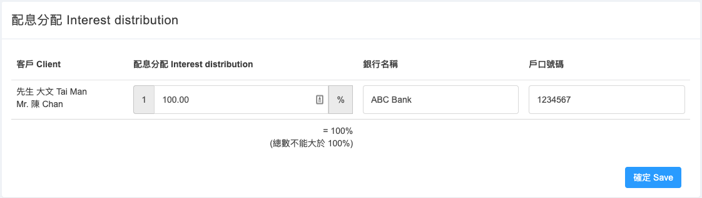  
The total interest distribution must equal to 100. Each applicants have their own bank account inforamion   
Click `確定 Save`

#Dividen Interest
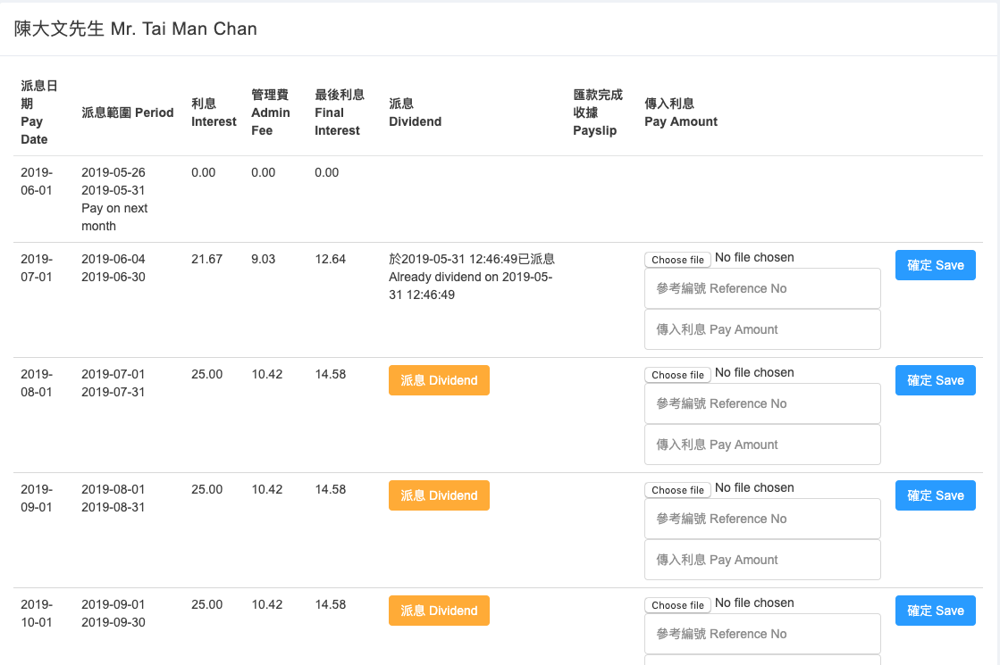  
Click `派息 Dividend` to add the interest to account   
Select `pay slip`, enter `reference no` and `pay amount` to record the withdraw interest
