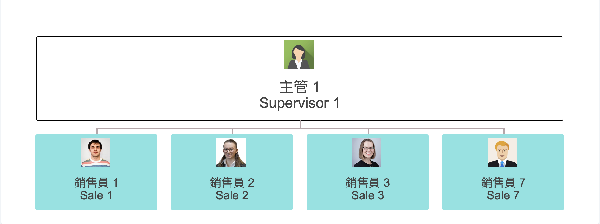

# Login 

  
**Testing Master Account:**  
ID: admin@carnival.com  
Password: 60538205  

#Staff User List
Side Menu -> `員工 Staff` -> `員工 Staff`  
  

#Create Staff User
Click `新增員工 Create Staff`
  
Fill in the form and press `確定 Save`

```
Select the Position will have different access right  
When the staff position is `Sales` please select the `Team`
```

#Edit Staff User
Click `詳細 Detail` in the right of the user list
  
Select `更改密碼 Password` to change the password  

#Access Right CheckList
Function | Master | Supervisor | Customer Service | Sales
------ | :------: | :------: | :------: | :------:
Create User | Y | N | N | N
Edit User | Y | N | N | N
Create Team | Y | N | N | N
Edit Team | Y | N | N | N
New Contract | Y | Y | Y | Y
New Client | Y | Y | Y | Y
Approve Contract | Y | Y | N | N
More to add...

#Team List
Side Menu -> `員工 Staff` -> `團隊 Team`
  

#Create Team
Click `新增團隊 Create Team`
  
Fill in the `Team Name` and press `確定 Save`  

  
Select the Supervisor (each team can have 1 more supervisors)  
Select the Sale Member (1 sale can only belong to 1 team)  
Press `確定 Save`  

#Edit Team / Team Detail
Click `詳細 Detail` in the right of the team list
  
  
